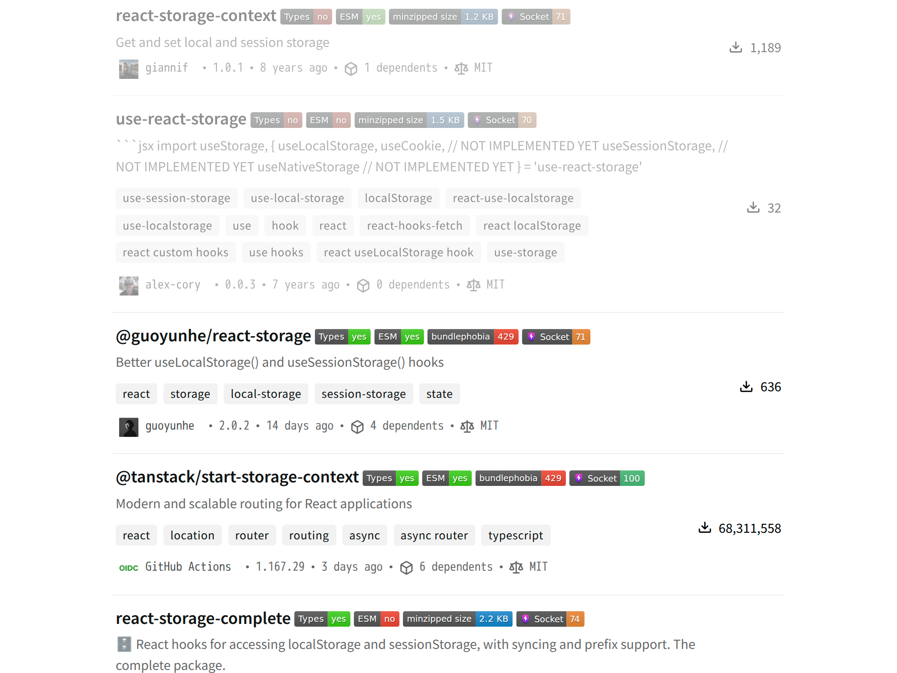
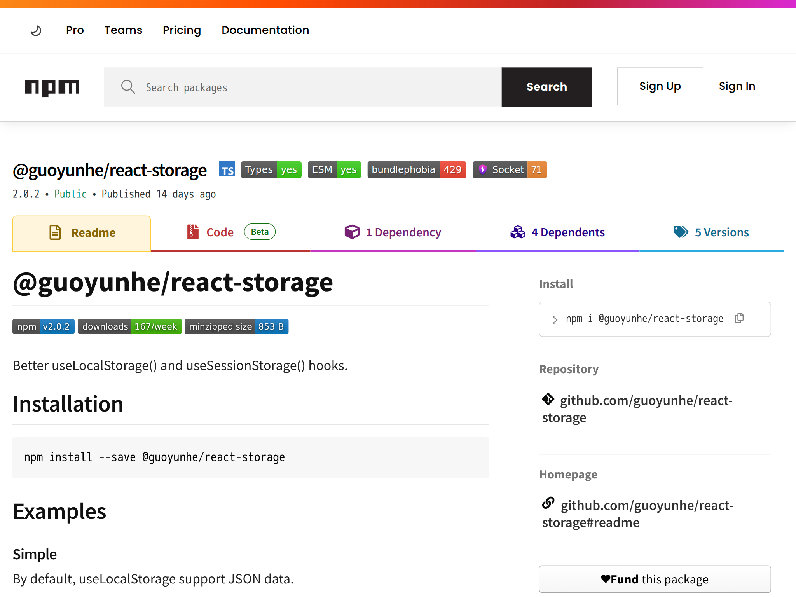

# npmjs.com enhancer

enhance the experience of npmjs.com

- show types badge
- show esm badge
- show bundle size (bundlephobia) badge
- show package quality score (socket) badge
- show node.js version badge
- dim out-dated packages from list

download the extension from [chrome web store](https://chrome.google.com/webstore/detail/npmjscom-enhancer/phbbcgflfmijkejdlipbkkecakgkfddb) or [firefox add-ons](https://addons.mozilla.org/firefox/addon/npmjscom-enhancer/).

